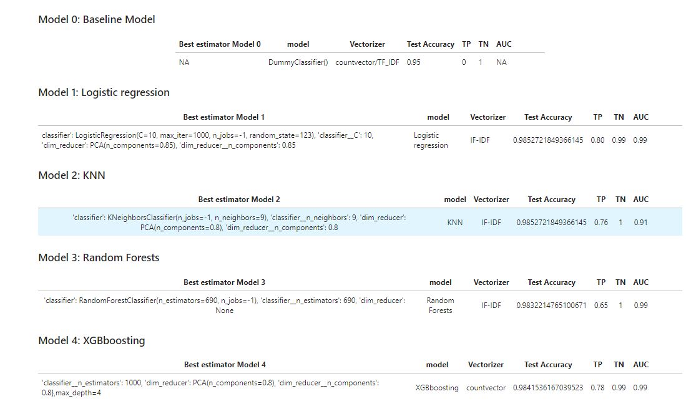
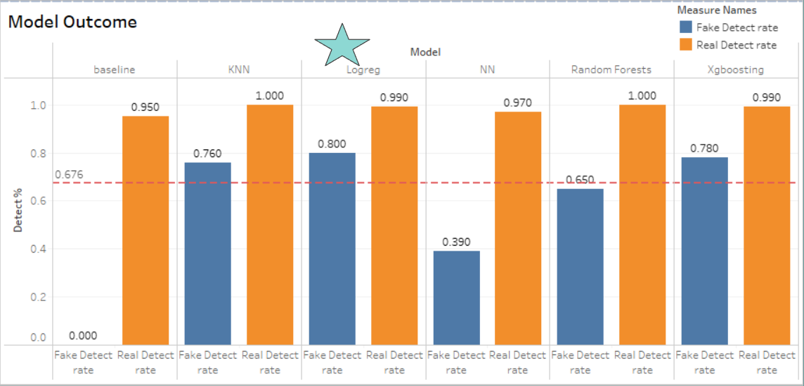
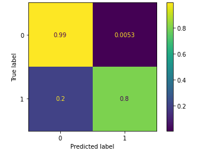
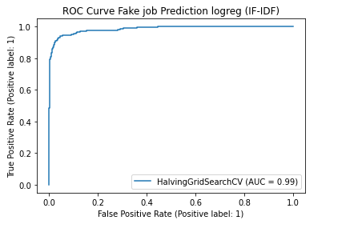
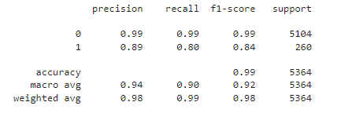

# Fake job Detection: Investigating Fake job posts to avoid the job scam

## Project Overview

In this project, I predicted fake job postings from a dataset listed with real-world job posts. The dataset is hosted by [Kaggle](https://www.kaggle.com/shivamb/real-or-fake-fake-jobposting-prediction), originally collected by The University of the Aegean | Laboratory of Information & Communication Systems Security. The dataset consists of 17,880 rows of job postings, and about 800 posts are fake. I use Machine Learning techniques and Natural Language Processing (NLP) to analyze job posts, build **Classification Models** that aim to predict fake jobs out of real ones, and evaluate them finding out **Topic Modelling**. I also perform various methods of data visualization and communication to convey findings and actionable insights.

## notebooks 

1. Loading and Cleaning
2. EDA
3. Text Pre-Processing
4. Modeling-v4/ Modeling-v5 (model depolyment study included)
5. Neural_network_and_Modeling

The folders in this file are required:

1. ‘data_folder’ - this contains all .pkl files that are necessary to run the notebooks, you can download from this link https://drive.google.com/drive/u/3/folders/1SNnWQBiwpCJjDusVaTR4hZ4_MeVp2sca

   down load, unzip and put all 3 child folders in the root directory.

2. requirement.txt

3. .ipynb files

4.  You also need 'lexvec-wikipedia-word-vectors' to run the notebook 5, you can download from this link.https://drive.google.com/file/d/1NtOjkNtbevgg5xWkcop62NYY332tmiJh/view

   put the downloaded file in folder word_vectors.
 
## Models
1. Logistic regression
2. KNN
3. Random Forests
4. XGboosting
5. Neural Network Deep learning
##  Performance

-   My baseline model has 0.95 acc score, and it can find out 95% of the real jobs.
-   My Dataset is real imbalance, there are 95% real job posts and about 5% fake jobs, We will get a 95% correct rate on find out a real jobs post base on random guessin.
-   All these model above (No1-No4) has some lift on Test accuracy score, I achieved 0.98 acc socre on all of these models (expect the baseline).
-   On average I see a  **4-5%**  about the  **improvement**  on predect  **TN (Real job posts)**.
-   All these model from 1 to 4 has a huge lift on detect Fake jobs. Compare with the baseline model, I get 0.6 to 0.8 recall on these models, Which is super excited result.
-   My  **Goal**  is to  **finding out more Fake jobs**, base on this matric, The  **best model**  is Model 1: Logistic regression.

##  Model outcome

## Best model
- Logistic regression

   
   
   